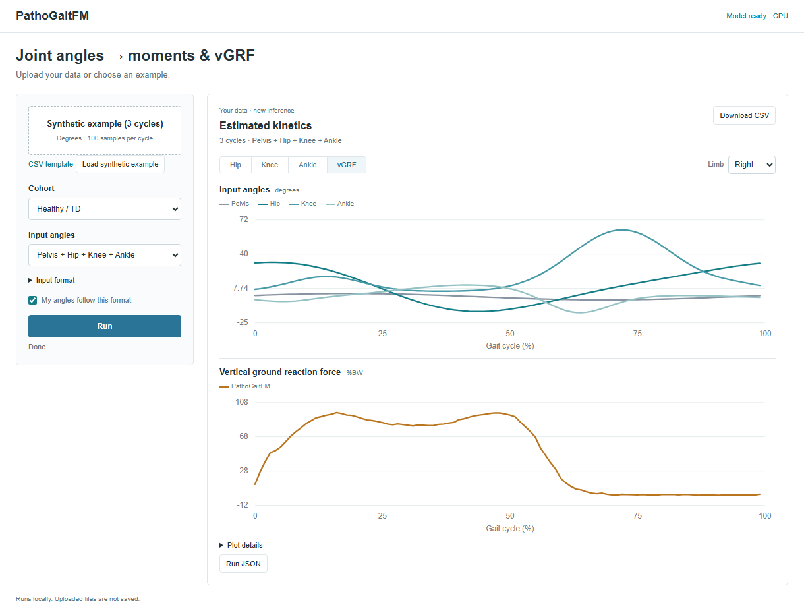

# PathoGaitFM

Code and trained weights for the manuscript *Foundation model for gait kinetics estimation across neurological and developmental cohorts from flexible kinematic inputs*.

PathoGaitFM estimates vertical ground reaction force (vGRF) and sagittal hip, knee and ankle moments from lower-limb joint angles over a normalised gait cycle. The input is a set of harmonised joint angles in degrees (bilateral hip, knee, ankle and pelvis, 16 channels, 100 samples per cycle); whole channels may be missing. The output is six sagittal moments in N·m/kg and bilateral vGRF in body weight. The model is a 1-D diffusion transformer pretrained on healthy gait and fine-tuned on cerebral palsy, typically developing, post-stroke and Parkinson cohorts; estimation is masked inpainting with 50 DDIM steps and three seeds, as in the manuscript.

## Demo



The local demo estimates hip, knee and ankle moments and vertical ground reaction force from a CSV of joint angles and plots them per limb. It ships with a synthetic example (three parametric gait cycles, no participant data), so it can be tried without any recording:

```sh
python -m pip install -r requirements.txt
python run_demo.py --checkpoint checkpoints/v4_stage2_final8ch_ALLDATA/final.pt
```

Open `http://127.0.0.1:8766`, click **Load synthetic example** and **Run**, or upload your own harmonised angle CSV. Inference runs on your computer, about ten seconds per run on a CPU; nothing is uploaded elsewhere. The checkpoint comes from the [v2026.09.27 release](https://github.com/wlia728-sketch/PathoGaitFM/releases/tag/v2026.09.27) (see Model weights below).

## Installation

```sh
python -m pip install torch --index-url https://download.pytorch.org/whl/cpu   # or a CUDA build
python -m pip install -r requirements.txt
```

Python 3.10 or later. CPU inference works; a GPU is only needed for training and the full evaluations.

## Model weights

The twelve checkpoints are assets of the [v2026.09.27 release](https://github.com/wlia728-sketch/PathoGaitFM/releases/tag/v2026.09.27). Download `<run>.pt`, rename it to `final.pt` under `checkpoints/<run>/`, and verify it:

```sh
python scripts/verify_weights.py --run v4_stage2_final8ch_ALLDATA
```

`v4_stage2_final8ch_ALLDATA` is the model used for new inputs and for the external evaluations. The five `expA_dynpool_cv5_*` folds give the cross-validation results, the five `scratch_cv5_*` folds the no-pretraining comparison, and `v4_stage1_unified_polarity_fixed` is the pretrained backbone. [Download instructions](docs/download_weights.md) and [checkpoint roles and hashes](checkpoints/CHECKPOINTS_MANIFEST.md) give the details.

## Input format

Angles must already follow the model's sign and zero conventions; the repository does not process markers, video or IMU signals. [Input contract](docs/data_format.md) defines the channel order, units, missing-channel handling and the seven input configurations.

## Run

Local demo (browser page, real inference on your computer, nothing uploaded elsewhere):

```sh
python run_demo.py --checkpoint checkpoints/v4_stage2_final8ch_ALLDATA/final.pt
```

Command line:

```sh
python example_usage/predict_kinetics.py --input angles.npy --cohort normal --checkpoint checkpoints/v4_stage2_final8ch_ALLDATA/final.pt
python example_usage/partial_input.py --input angles.npy --cohort cp --checkpoint checkpoints/v4_stage2_final8ch_ALLDATA/final.pt
```

`angles.npy` has shape `(100, 16)` or `(B, 100, 16)`. `partial_input.py` runs all seven input configurations on the same cycles. See [the demo notes](demo/README.md).

## Training and evaluation

Training data are not distributed. [Training](docs/training.md) lists the commands that produced the released checkpoints and the format of the split, severity and polarity files that must be built locally from the source datasets. The evaluation scripts under `scripts/eval/` read the same locally prepared arrays and write JSON results under `outputs/`; each script names the inputs it needs and fails before inference when one is missing. `results/PAPER_RESULTS.md` lists the aggregate numbers reported in the manuscript.

## Data sources

| Dataset | Used for | Original download |
|---|---|---|
| AddBiomechanics (Camargo 2021, Carter 2023, Moore 2015, Tan 2022, Tan 2023, van der Zee 2022, Wang 2023) | pretraining | https://addbiomechanics.org/download_data.html |
| Van Criekinge 2023, healthy adults and adults after stroke | pretraining; stroke cohort | https://doi.org/10.1038/s41597-023-02767-y |
| Shida 2023 (BMClab), Parkinson's disease | PD cohort | https://doi.org/10.6084/m9.figshare.14896881 |
| Yueyang Hospital, children with CP and TD children | CP and TD cohorts | restricted by ethics approval; not distributed |
| Meyns 2017 (Leuven), children with CP and TD | external vGRF | https://simtk.org/projects/cp-child-gait |
| Steele 2010 (Gillette), crouch gait | external vGRF | https://simtk.org/projects/crouchgait |
| Fukuchi 2018 (WBDS), healthy adults | external vGRF and moments | https://doi.org/10.7717/peerj.4640 |
| Viglialoro 2025 (PD-Nordic), Parkinson's disease | external vGRF | https://doi.org/10.6084/m9.figshare.29371769 |
| Uhlrich 2023 (OpenCap), healthy adults | external moments; marker/video vGRF | https://doi.org/10.1371/journal.pcbi.1011462 |
| Grouvel 2023, healthy adults | marker/IMU vGRF | https://doi.org/10.1038/s41597-023-02077-3 |

[Data sources](data/README.md) gives the terms of each release, the harmonisation scripts and the local layout the scripts expect.

## Figures

`figures/` holds the five manuscript figures with their captions; `scripts/figures/export_figures.py` verifies and copies them. `scripts/figures/replot_results.py` draws the numerical panels from locally produced evaluation results.

## Tests

```sh
python -m pyflakes .
python tests/smoke_test.py
python -m unittest discover -s tests -p "test_*.py"
```

The tests need no data and no weights.

## Licence and citation

The code is released under the MIT licence (`LICENSE`) and the trained weights under CC BY 4.0 (attribution by citing the manuscript; research software, not a medical device). Third-party components are listed in `THIRD_PARTY_NOTICES.md`. Datasets remain under the terms of their original releases. Cite the manuscript; `CITATION.cff` holds the software citation.
